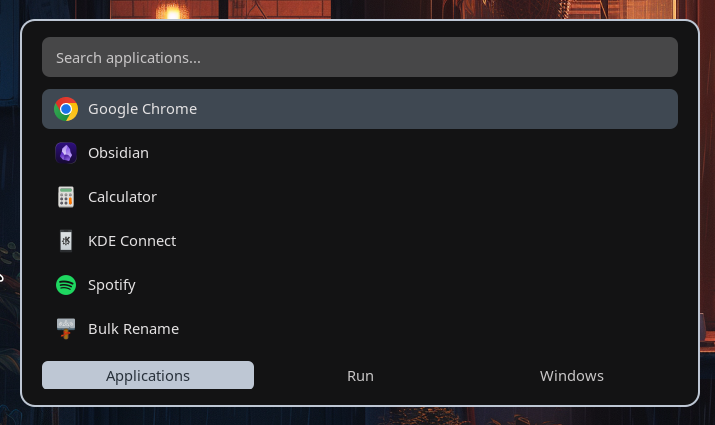
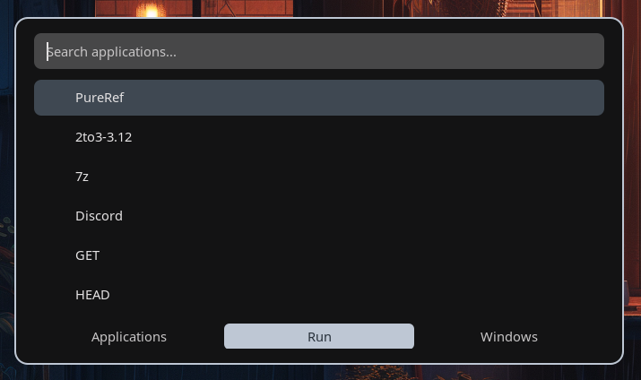
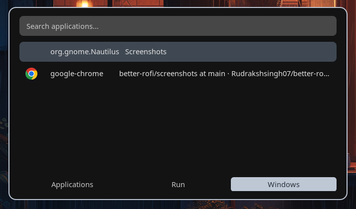

# better-rofi

<div align="center">

[](LICENSE)
[](https://github.com/davatorium/rofi)
[](https://www.linux.org/)
[](https://github.com/YOUR_USERNAME/better-rofi/stargazers)

**A PowerToys Run-inspired Rofi configuration for Linux power users**

*Transform Rofi into a fast, keyboard-driven launcher with PowerToys-like functionality*

[](https://github.com/YOUR_USERNAME/better-rofi/releases)
[](#-installation)
[](https://github.com/YOUR_USERNAME/better-rofi/issues)

</div>

---

## 📖 Table of Contents

- [Overview](#-overview)
- [Features](#-features)
- [Screenshots](#-screenshots)
- [Installation](#-installation)
- [Usage](#-usage)
- [Customization](#-customization)
- [Troubleshooting](#-troubleshooting)
- [Contributing](#-contributing)
- [License](#-license)

---

## 🎯 Overview

This isn't a new tool - it's a **carefully crafted Rofi configuration** that unlocks Rofi's full potential out of the box. Instead of spending hours tweaking settings, get a production-ready launcher with intelligent defaults and a PowerToys Run-inspired workflow.

<div align="center">

[](https://github.com/microsoft/PowerToys)
[](https://github.com/davatorium/rofi)

</div>

### Perfect for:
- 🪟 Windows users missing PowerToys Run after switching to Linux
- ⚡ Linux power users seeking an optimized launcher experience
- 🚀 Anyone wanting Rofi's power without the configuration headache

---

## ✨ Features

### 🎯 Three Powerful Modes
Access everything through a clean sidebar interface:
- **Applications Mode** - Launch desktop apps (Chrome, Firefox, VS Code, etc.)
- **Run Mode** - Execute any command or script directly
- **Windows Mode** - Switch between open windows with live previews

### ⚡ Smart & Fast
- **Fuzzy Search** - Type partial names like "chr" to find Chrome
- **Intelligent Ranking** - FZF algorithm prioritizes best matches
- **Usage-Aware** - Frequently used apps automatically rank higher
- **Lightning Fast** - Optimized for instant response

### ⌨️ Keyboard-First Workflow
- Launch with `Alt+Space` (customizable)
- Navigate with arrow keys
- Switch modes with `Alt+Left/Right`
- Text editing shortcuts (`Ctrl+A`, `Ctrl+Backspace`, etc.)

### 🎨 Visual Polish
- App icons for instant recognition
- Window thumbnails when switching
- Hover-to-select mouse support
- Clean, modern interface
- Compatible with all Rofi themes

---

## 📸 Screenshots

### Applications Mode

*Launch desktop applications with fuzzy search and app icons*

### Run Mode

*Execute commands and scripts directly from the launcher*

### Windows Mode

*Switch between open windows with live previews*

### Theme Variations
<div align="center">

| Dark Theme | Light Theme | Custom Theme |
|------------|-------------|--------------|
|  |  |  |

</div>

> **📸 Want to contribute screenshots?** We'd love to see your setup! Please submit screenshots via [pull request](https://github.com/YOUR_USERNAME/better-rofi/pulls) or [open an issue](https://github.com/YOUR_USERNAME/better-rofi/issues) with your images.

---

## 🚀 Installation

<div align="center">

[](#step-3-install-better-rofi-configuration)
[](#option-b-manual-install)

</div>

### Step 1: Install Rofi

Choose your distribution:

<div align="center">

| Distribution | Command |
|--------------|---------|
|   | `sudo apt update && sudo apt install rofi` |
|   | `sudo pacman -S rofi` |
|  | `sudo dnf install rofi` |
|  | `sudo zypper install rofi` |
|  | `sudo emerge --ask x11-misc/rofi` |
|  | Add `rofi` to `environment.systemPackages` |

</div>

#### Other Distributions
[](https://github.com/davatorium/rofi)

---

### Step 2: Verify Rofi Installation

```bash
rofi -version
```

✅ You should see version information. If not, Rofi isn't properly installed.

---

### Step 3: Install better-rofi Configuration

#### Option A: Quick Install (Recommended)

```bash
# Clone the repository
git clone https://github.com/YOUR_USERNAME/better-rofi.git

# Create Rofi config directory if it doesn't exist
mkdir -p ~/.config/rofi

# Backup existing config (if you have one)
[ -f ~/.config/rofi/config.rasi ] && cp ~/.config/rofi/config.rasi ~/.config/rofi/config.rasi.backup

# Copy the configuration file
cp better-rofi/config.rasi ~/.config/rofi/config.rasi
```

[](https://github.com/YOUR_USERNAME/better-rofi.git)

#### Option B: Manual Install

1. **Create the config directory:**
```bash
mkdir -p ~/.config/rofi
```

2. **Download the config file:**

[](https://raw.githubusercontent.com/YOUR_USERNAME/better-rofi/main/config.rasi)

Save it to `~/.config/rofi/config.rasi`

3. **Or create manually:**
```bash
nano ~/.config/rofi/config.rasi
# Paste the config contents and save (Ctrl+X, then Y, then Enter)
```

---

### Step 4: Set Up Keyboard Shortcut

You need to bind a keyboard shortcut to launch Rofi. Choose your desktop environment:

<details>
<summary><b>🟣 GNOME</b> (Ubuntu, Pop!_OS, Fedora Workstation)</summary>

1. Open **Settings** → **Keyboard** → **Keyboard Shortcuts**
2. Scroll down and click **"View and Customize Shortcuts"**
3. Click **"Custom Shortcuts"** at the bottom
4. Click the **"+"** button to add a new shortcut
5. Fill in:
   - **Name:** `Rofi Launcher`
   - **Command:** `rofi -show drun`
   - **Shortcut:** Click "Set Shortcut" and press `Alt+Space`

**Note:** You may need to disable the default `Alt+Space` binding first (usually mapped to "Activate the window menu").

[](https://help.gnome.org/users/gnome-help/stable/keyboard-shortcuts-set.html)

</details>

<details>
<summary><b>🔵 KDE Plasma</b> (Kubuntu, KDE Neon)</summary>

1. Open **System Settings** → **Shortcuts** → **Custom Shortcuts**
2. Right-click in the panel → **New** → **Global Shortcut** → **Command/URL**
3. In the **Trigger** tab: Press `Alt+Space`
4. In the **Action** tab: Enter `rofi -show drun`
5. Click **Apply**

[](https://docs.kde.org/)

</details>

<details>
<summary><b>🐭 XFCE</b> (Xubuntu)</summary>

1. Open **Settings** → **Keyboard** → **Application Shortcuts**
2. Click **"Add"**
3. Enter command: `rofi -show drun`
4. Press `Alt+Space` when prompted

[](https://docs.xfce.org/)

</details>

<details>
<summary><b>⌨️ i3 / Sway</b></summary>

Add to your config file (`~/.config/i3/config` or `~/.config/sway/config`):

```bash
# Launch Rofi
bindsym $mod+space exec rofi -show drun
```

Replace `$mod+space` with your preferred keybind. Reload config with `$mod+Shift+r`.

[](https://i3wm.org/docs/)
[](https://swaywm.org/)

</details>

<details>
<summary><b>📦 Openbox</b></summary>

Edit `~/.config/openbox/rc.xml` and add:

```xml
<keybind key="A-space">
  <action name="Execute">
    <command>rofi -show drun</command>
  </action>
</keybind>
```

Reload with `openbox --reconfigure`.

[](http://openbox.org/wiki/Help:Contents)

</details>

<details>
<summary><b>🔧 Other Window Managers / DEs</b></summary>

Consult your window manager's documentation for setting custom keybindings. The command to run is:
```bash
rofi -show drun
```

</details>

---

### Step 5: Test It Out!

[](#)

1. Press `Alt+Space` (or your chosen keybind)
2. Rofi should appear with the Applications mode
3. Start typing to search for apps
4. Use `Alt+Left/Right` to switch between modes
5. Press `Enter` to launch

---

## 🎮 Usage

### Keyboard Shortcuts

| Shortcut | Action |
|----------|--------|
| `Alt+Space` | Open Rofi launcher |
| `↑` / `↓` | Navigate through results |
| `Enter` | Launch selected item |
| `Esc` | Close Rofi |
| `Alt+Left` / `Alt+Right` | Switch between modes |
| `Ctrl+A` | Select all text |
| `Ctrl+Backspace` | Delete word |
| `Ctrl+U` | Clear input |

### Modes

**Applications Mode (drun)**
- Search and launch desktop applications
- Shows app icons
- Ranks by usage frequency

**Run Mode**
- Execute terminal commands
- Run scripts
- Access system utilities

**Windows Mode**
- Switch between open windows
- Shows window previews
- Quick navigation

---

## ⚙️ Customization

The config file is organized into clear sections at `~/.config/rofi/config.rasi`:

[](~/.config/rofi/config.rasi)

### Change Theme
Rofi supports many themes. List available themes:
```bash
rofi-theme-selector
```

[](https://github.com/davatorium/rofi-themes)

Or edit the config file and modify the theme line.

### Adjust Appearance
Edit `~/.config/rofi/config.rasi` and modify:
- `width` / `height` - Window dimensions
- `font` - Interface font
- `icon-theme` - Icon pack to use

### Modify Keybindings
Search for the keybinding section in the config and adjust shortcuts to your preference.

### Add More Modes
Rofi supports additional modes like `ssh`, `file-browser`, etc. Add them in the configuration.

[](https://github.com/davatorium/rofi/wiki)

---

## 🔧 Troubleshooting

<details>
<summary><b>❌ Rofi doesn't open when I press the keybind</b></summary>

- Verify Rofi is installed: `rofi -version`
- Test manually: `rofi -show drun`
- Check if another application is using the same keybind
- Ensure the keybind was saved correctly in your DE settings

</details>

<details>
<summary><b>🖼️ Icons don't appear</b></summary>

- Install an icon theme:
  ```bash
  sudo apt install papirus-icon-theme  # Ubuntu/Debian
  sudo pacman -S papirus-icon-theme    # Arch
  ```
- Set the icon theme in `~/.config/rofi/config.rasi`

[](https://github.com/PapirusDevelopmentTeam/papirus-icon-theme)

</details>

<details>
<summary><b>🎨 Rofi looks different than expected</b></summary>

- Make sure you copied the config to the correct location: `~/.config/rofi/config.rasi`
- Check for syntax errors: `rofi -dump-config`

</details>

<details>
<summary><b>📱 Applications don't show up</b></summary>

- Update desktop database: `update-desktop-database ~/.local/share/applications`
- Check if `.desktop` files exist in `/usr/share/applications`

</details>

<details>
<summary><b>🪟 Window mode doesn't work</b></summary>

- Ensure you're running a compositor (required for window previews)
- Try: `rofi -show window` manually to test

</details>

[](https://github.com/YOUR_USERNAME/better-rofi/issues)

---

## 🤝 Contributing

Contributions are welcome! Here's how you can help:

<div align="center">

[](https://github.com/YOUR_USERNAME/better-rofi/issues)
[](https://github.com/YOUR_USERNAME/better-rofi/issues)
[](https://github.com/YOUR_USERNAME/better-rofi/pulls)

</div>

- 🐛 Report bugs or issues
- 💡 Suggest new features or improvements
- 📸 Add screenshots (especially needed!)
- 📝 Improve documentation
- ⚙️ Submit optimized configurations

**To contribute:**
1. Fork the repository
2. Create a feature branch (`git checkout -b feature/amazing-feature`)
3. Commit your changes (`git commit -m 'Add amazing feature'`)
4. Push to the branch (`git push origin feature/amazing-feature`)
5. Open a Pull Request

[](https://github.com/YOUR_USERNAME/better-rofi/fork)

---

## 📄 License

This is free and unencumbered software released into the public domain.

Anyone is free to copy, modify, publish, use, compile, sell, or distribute this software, either in source code form or as a compiled binary, for any purpose, commercial or non-commercial, and by any means.

For more information, please refer to the [UNLICENSE](UNLICENSE) file or visit <https://unlicense.org/>

[](UNLICENSE)

---

## 🙏 Acknowledgments

<div align="center">

[](https://github.com/davatorium/rofi)
[](https://github.com/microsoft/PowerToys)
[](https://www.linux.org/)

</div>

- [Rofi](https://github.com/davatorium/rofi) - The amazing application launcher this config is built on
- [PowerToys Run](https://github.com/microsoft/PowerToys) - Inspiration for the workflow and UX
- The Linux community for endless dotfile inspiration

---

## ⭐ Show Your Support

If this config made your workflow better, consider:

<div align="center">

[](https://github.com/YOUR_USERNAME/better-rofi)
[](https://twitter.com/intent/tweet?text=Check%20out%20better-rofi%20-%20A%20PowerToys%20Run-inspired%20Rofi%20config!&url=https://github.com/YOUR_USERNAME/better-rofi)

</div>

---

<div align="center">

**Made with ❤️ for the Linux community**

[](https://github.com/YOUR_USERNAME)
[](https://github.com/YOUR_USERNAME/better-rofi/issues)
[](https://github.com/YOUR_USERNAME/better-rofi/issues)


</div>
