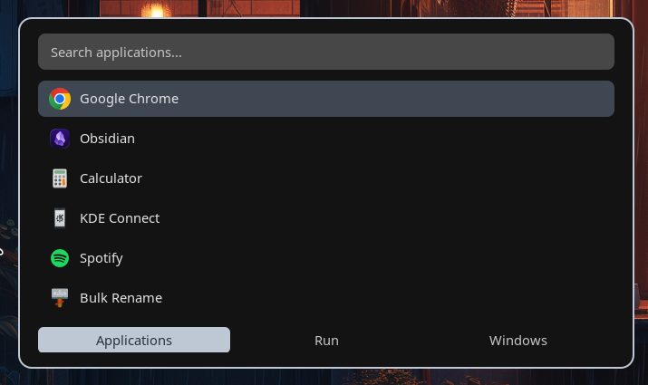
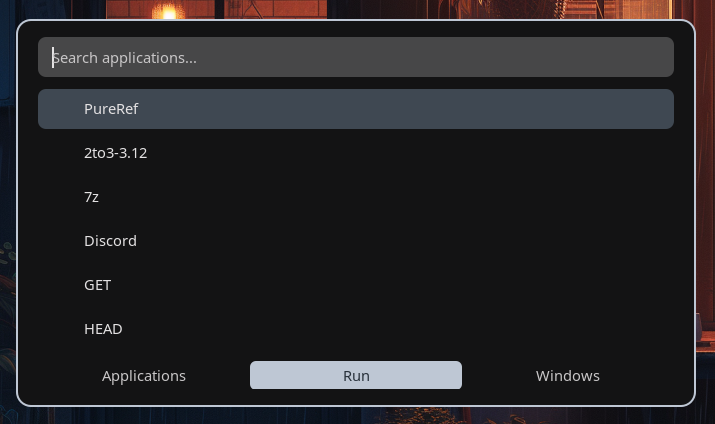
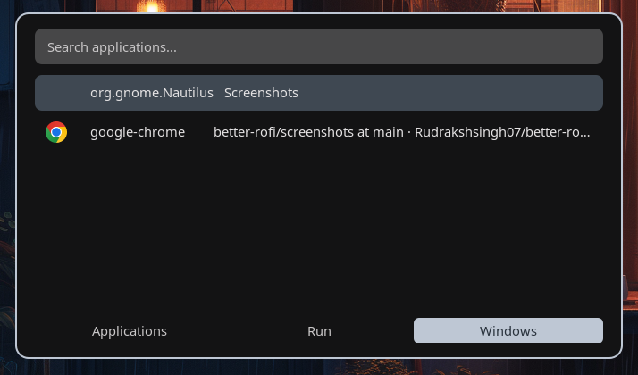

# better-rofi

<div align="center">

[](LICENSE)
[](https://github.com/davatorium/rofi)
[](https://www.linux.org/)
[](https://github.com/Rudrakshsingh07/better-rofi/stargazers)

**A PowerToys Run-inspired Rofi configuration for Linux power users**

*Transform Rofi into a fast, keyboard-driven launcher with PowerToys-like functionality and automatic wallpaper-based theming*

[](https://github.com/Rudrakshsingh07/better-rofi/releases)
[](#-installation)
[](https://github.com/Rudrakshsingh07/better-rofi/issues)

</div>

---

## 📖 Table of Contents

- [Overview](#-overview)
- [Features](#-features)
- [Screenshots](#-screenshots)
- [Installation](#-installation)
- [Wallpaper-Based Theming](#-wallpaper-based-theming-matugen)
- [Usage](#-usage)
- [Customization](#-customization)
- [Troubleshooting](#-troubleshooting)
- [Contributing](#-contributing)
- [License](#-license)

---

## 🎯 Overview

This isn't a new tool - it's a **carefully crafted Rofi configuration** that unlocks Rofi's full potential out of the box. Instead of spending hours tweaking settings, get a production-ready launcher with intelligent defaults, a PowerToys Run-inspired workflow, and **automatic Material You theming driven by your wallpaper**.

<div align="center">

[](https://github.com/microsoft/PowerToys)
[](https://github.com/davatorium/rofi)
[](https://github.com/InioX/matugen)

</div>

### Perfect for:
- 🪟 Windows users missing PowerToys Run after switching to Linux
- ⚡ Linux power users seeking an optimized launcher experience  
- 🎨 Rice enthusiasts who want their launcher to match their wallpaper automatically
- 🚀 Anyone wanting Rofi's power without the configuration headache

---

## ✨ Features

### 🎯 Three Powerful Modes
Access everything through a clean sidebar interface:
- **Applications Mode** - Launch desktop apps (Chrome, Firefox, VS Code, etc.)
- **Run Mode** - Execute any command or script directly
- **Windows Mode** - Switch between open windows with live previews

### ⚡ Smart & Fast
- **Fuzzy Search** - Type partial names like "chr" to find Chrome
- **Intelligent Ranking** - FZF algorithm prioritizes best matches
- **Usage-Aware** - Frequently used apps automatically rank higher
- **Lightning Fast** - Optimized for instant response

### ⌨️ Keyboard-First Workflow
- Launch with `Alt+Space` (customizable)
- Navigate with arrow keys
- Switch modes with `Alt+Left/Right`
- Text editing shortcuts (`Ctrl+A`, `Ctrl+Backspace`, etc.)

### 🎨 Automatic Wallpaper-Based Theming
- Powered by **matugen** — generates a full Material Design 3 color palette from your wallpaper
- Colors update automatically every time your wallpaper changes
- No manual color picking, ever
- Works seamlessly with **end-4 dots-hyprland** and any other rice using matugen

### 🖼️ Visual Polish
- App icons for instant recognition
- Window thumbnails when switching
- Highlighted selection with `primary-container` color from your wallpaper palette
- Clean search placeholder that disappears as you type
- Rounded corners and comfortable padding throughout

---

## 📸 Screenshots

### Applications Mode

*Launch desktop applications with fuzzy search and app icons*

### Run Mode

*Execute commands and scripts directly from the launcher*

### Windows Mode

*Switch between open windows with live previews*

> **📸 Want to contribute screenshots?** We'd love to see your setup! Please submit screenshots via [pull request](https://github.com/Rudrakshsingh07/better-rofi/pulls) or [open an issue](https://github.com/Rudrakshsingh07/better-rofi/issues) with your images.

---

## 🚀 Installation

### Step 1: Install Rofi

<div align="center">

| Distribution | Command |
|--------------|---------|
|   | `sudo apt install rofi` |
|  | `sudo pacman -S rofi-wayland` |
|  | `sudo dnf install rofi` |

</div>

> **Wayland users (Hyprland, Sway):** Use `rofi-wayland` instead of `rofi` for proper Wayland support.

---

### Step 2: Install better-rofi Configuration

```bash
# Clone the repository
git clone https://github.com/Rudrakshsingh07/better-rofi.git

# Create Rofi config directory if it doesn't exist
mkdir -p ~/.config/rofi

# Backup existing config (if you have one)
[ -f ~/.config/rofi/config.rasi ] && cp ~/.config/rofi/config.rasi ~/.config/rofi/config.rasi.backup

# Copy configuration files
cp better-rofi/config.rasi ~/.config/rofi/config.rasi
cp better-rofi/theme.rasi ~/.config/rofi/theme.rasi
```

---

### Step 3: Set Up Keyboard Shortcut

**Hyprland** — add to `~/.config/hypr/hyprland.conf`:
```ini
bind = ALT, SPACE, exec, rofi -show drun
```

**i3 / Sway** — add to your config:
```ini
bindsym Mod1+space exec rofi -show drun
```

---

### Step 4: Test It Out

Press `Alt+Space` — Rofi should appear. Start typing to search for apps.

---

## 🎨 Wallpaper-Based Theming (matugen)

better-rofi supports **automatic color generation from your wallpaper** using [matugen](https://github.com/InioX/matugen). Every time your wallpaper changes, Rofi's colors update to match — no manual configuration needed.

### How it works

```
wallpaper change → matugen runs → generates colors.rasi → rofi reloads with new palette
```

Matugen analyzes your wallpaper, extracts a Material Design 3 color palette, and writes it to `~/.config/rofi/colors.rasi`. The theme then uses those variables for all UI colors.

### Setup

**1. Install matugen:**
```bash
# Arch
yay -S matugen-bin

# Cargo
cargo install matugen
```

**2. Create the matugen rofi template:**
```bash
mkdir -p ~/.config/matugen/templates
```

Create `~/.config/matugen/templates/rofi-colors.rasi`:
```
* {
    primary:              {{colors.primary.default.hex}};
    on-primary:           {{colors.on_primary.default.hex}};
    primary-container:    {{colors.primary_container.default.hex}};
    on-primary-container: {{colors.on_primary_container.default.hex}};
    secondary:            {{colors.secondary.default.hex}};
    on-secondary:         {{colors.on_secondary.default.hex}};
    surface:              {{colors.surface.default.hex}};
    on-surface:           {{colors.on_surface.default.hex}};
    surface-variant:      {{colors.surface_variant.default.hex}};
    on-surface-variant:   {{colors.on_surface_variant.default.hex}};
    background:           {{colors.background.default.hex}};
    on-background:        {{colors.on_background.default.hex}};
}
```

**3. Register the template in `~/.config/matugen/config.toml`:**
```toml
[templates.rofi]
input_path = '~/.config/matugen/templates/rofi-colors.rasi'
output_path = '~/.config/rofi/colors.rasi'
```

**4. Generate colors from your current wallpaper:**
```bash
matugen image /path/to/your/wallpaper.jpg
```

**5. Verify it worked:**
```bash
cat ~/.config/rofi/colors.rasi
# Should show hex color values
```

From now on, whenever matugen runs (automatically on wallpaper change in supported rices), Rofi's colors will update to match.

> **end-4 dots-hyprland users:** matugen is already wired into your wallpaper pipeline. Just add the template and register it — everything else is automatic.

---

## 🎮 Usage

### Keyboard Shortcuts

| Shortcut | Action |
|----------|--------|
| `Alt+Space` | Open Rofi launcher |
| `↑` / `↓` | Navigate through results |
| `Enter` | Launch selected item |
| `Esc` | Close Rofi |
| `Alt+Left` / `Alt+Right` | Switch between modes |
| `Ctrl+Tab` | Switch to next mode |
| `Ctrl+A` | Move cursor to start |
| `Ctrl+E` | Move cursor to end |
| `Ctrl+Backspace` | Delete word |

### Modes

**Applications Mode (drun)** — Search and launch desktop applications with icons and usage-ranked results.

**Run Mode** — Execute terminal commands and scripts directly.

**Windows Mode** — Switch between open windows with live previews.

---

## ⚙️ Customization

### Theme File Structure

```
~/.config/rofi/
├── config.rasi       # Main configuration (modes, keybinds, behavior)
├── theme.rasi        # Visual layout and styling
└── colors.rasi       # Auto-generated by matugen (do not edit manually)
```

### Adjust Sizing
Edit the `window` block in `theme.rasi`:
```css
window {
    width:   680px;   /* wider = more horizontal space */
    padding: 16px 20px;
}
```

Adjust visible results:
```css
listview {
    lines: 6;   /* number of apps shown at once */
}
```

### Change Font
In `theme.rasi`, update:
```css
* {
    font: "JetBrainsMono Nerd Font 11";
}
```

### Use Without matugen
If you don't use matugen, remove the `@import "colors.rasi"` line from `theme.rasi` and define your own colors directly in the `* {}` block at the top of `theme.rasi`.

---

## 🔧 Troubleshooting

<details>
<summary><b>❌ Rofi doesn't open when I press the keybind</b></summary>

- Verify Rofi is installed: `rofi -version`
- Test manually: `rofi -show drun`
- Check if another application is using the same keybind

</details>

<details>
<summary><b>🎨 Colors not updating from wallpaper</b></summary>

- Verify matugen is installed: `matugen --version`
- Check the template is registered in `~/.config/matugen/config.toml`
- Run matugen manually: `matugen image /path/to/wallpaper.jpg`
- Check if `~/.config/rofi/colors.rasi` was created

</details>

<details>
<summary><b>⚠️ "Error while parsing theme" on startup</b></summary>

- `colors.rasi` may not exist yet — run matugen at least once manually
- Check that `@import "colors.rasi"` is at the very top of `theme.rasi`, not inside any block
- Check that `@theme` is outside the `configuration {}` block in `config.rasi`

</details>

<details>
<summary><b>🖼️ Icons don't appear</b></summary>

Install Papirus icon theme:
```bash
sudo dnf install papirus-icon-theme      # Fedora
sudo pacman -S papirus-icon-theme        # Arch
sudo apt install papirus-icon-theme      # Debian/Ubuntu
```

</details>

<details>
<summary><b>🪟 Window mode doesn't work on Hyprland</b></summary>

Make sure you're using `rofi-wayland` and not the X11 build of rofi.

</details>

---

## 🤝 Contributing

Contributions are welcome!

[](https://github.com/Rudrakshsingh07/better-rofi/issues)
[](https://github.com/Rudrakshsingh07/better-rofi/issues)
[](https://github.com/Rudrakshsingh07/better-rofi/pulls)

Screenshots are especially needed — if you have a nice setup, open a PR!

---

## 📄 License

This is free and unencumbered software released into the public domain. See [UNLICENSE](UNLICENSE) for details.

---

## 🙏 Acknowledgments

- [Rofi](https://github.com/davatorium/rofi) — the launcher this config is built on
- [matugen](https://github.com/InioX/matugen) — Material You color generation from wallpapers
- [end-4/dots-hyprland](https://github.com/end-4/dots-hyprland) — wallpaper pipeline inspiration
- [PowerToys Run](https://github.com/microsoft/PowerToys) — UX inspiration

---

<div align="center">

**Made with ❤️ for the Linux community**

[](https://github.com/Rudrakshsingh07)


</div>
